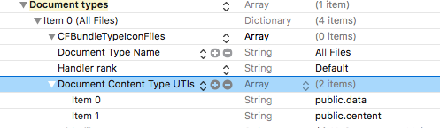

### 冲突：
官方SDK 与 ShareSDK 集成在同一个Project中，不同的target时：
当使用如下引入方式时，会出现冲突问题： 
```objc
#import <WXApi.h>
```
解决办法，将包的位置写完即可,如下：
```objc
#import <WechatOpenSDK/WXApi.h>
```
其他相关API引入，也要保证引入的是全路径。

### URL scheme

如果无法正确检查微信／qq已安装，或无法打开微信／QQ程序   
常见提示：尚未安装****  ／ 没有配置URL scheme   

则需要完成如下配置：   
1. 开启APP之间的URL scheme权限 
LSApplicationQueriesSchemes在ios9之后改变了URLScheme 的用法
其中微信端三个，QQ包含若干
```xml
<?xml version="1.0" encoding="UTF-8"?>
<!DOCTYPE plist PUBLIC "-//Apple//DTD PLIST 1.0//EN" "http://www.apple.com/DTDs/PropertyList-1.0.dtd">
<plist version="1.0">
<array>
<string>wtloginmqq2</string>
<string>mqqopensdkapiV3</string>
<string>mqqwpa</string>
<string>mqqopensdkapiV2</string>
<string>mqqOpensdkSSoLogin</string>
<string>mqq</string>
<string>mqqapi</string>
<string>weixin</string>
<string>wechat</string>
</array>
</plist>
```
2. 配置URL scheme
```xml
<?xml version="1.0" encoding="UTF-8"?>
<!DOCTYPE plist PUBLIC "-//Apple//DTD PLIST 1.0//EN" "http://www.apple.com/DTDs/PropertyList-1.0.dtd">
<plist version="1.0">
<array>
<dict>
<key>CFBundleTypeRole</key>
<string>Editor</string>
<key>CFBundleURLName</key>
<string>tencent</string>
<key>CFBundleURLSchemes</key>
<array>
<string>tencent100569483</string>
</array>
</dict>
<dict>
<key>CFBundleTypeRole</key>
<string>Editor</string>
<key>CFBundleURLSchemes</key>
<array>
<string>wx8e7cab3c5d3fbe7f</string>
</array>
</dict>
<dict>
<key>CFBundleTypeRole</key>
<string>Editor</string>
<key>CFBundleURLName</key>
<string>QQ</string>
<key>CFBundleURLSchemes</key>
<array>
<string>QQ05FE918B</string>
</array>
</dict>
</array>
</plist>

```


### 制定APP打开文件类型
Uniform type identifiers(UTIs)提供了在整个系统里面标识数据的一个统一的方式，比如documents(文档)、pasteboard data(剪贴板数据)和bundles(包)。

### 真机调试免费App ID出现的问题
`The maximum number of apps for free development profiles has been reached.`

免费应用程序调试最大限度

苹果免费App ID只能运行2个应用程序,当调试第三个的时候就会报这个错误,必须把之前的应用程序删除,才能调试新。

[解决方案](http://www.jianshu.com/p/99c441070b22)

### 系统提供的分享方式

1. UIDocumentInteractionController方式

//需要使用全局变量，否则会因对象提早释放报错：`UIDocumentInteractionController has gone away prematurely`

```objc
- (void)setupDocumentControllerWithURL:(NSURL *)url
{
UIDocumentInteractionController * docInteractionController = [UIDocumentInteractionController interactionControllerWithURL:url];
CGRect navRect;
if ([[UIDevice currentDevice] userInterfaceIdiom] == UIUserInterfaceIdiomPhone) {
navRect = self.navigationController.navigationBar.frame;
navRect.size = CGSizeMake(1500.0f, 30.0f);
}else{

navRect = _ibRightView.frame;
navRect.origin = CGPointMake(navRect.origin.x - 40, navRect.origin.y + 20);
//      navRect.origin.x = CGRectGetMinX(navRect) - 40;

}
[docInteractionController presentOpenInMenuFromRect:navRect inView:self.view  animated:YES];
}
```
### quicklook 支持同时浏览多个文件
```objc
#pragma mark - QuickLook
-(IBAction)QuickLook:(id)sender
{
QLPreviewController *preView = [[QLPreviewController alloc] init];
preView.dataSource = self;
[self presentViewController:preView animated:YES completion:nil];
}


/**
这里我返回的PreviewItems的数量为1，就是一次加载一个文件，这里可以是多个文件的数组个数，也就是某个本地路径下的多个文件，大家可以自己实现下。

@param controller 当前浏览器控制器
@return 一次浏览文件的个数，返回Url数组的文件个数
*/
-(NSInteger)numberOfPreviewItemsInPreviewController:(QLPreviewController *)controller
{
return preFileURLs.count;
}

/**
其实NSURL的分类遵循了QLPreviewItem协议，这里可以返回一个Url数组。这就是预览多个文件时的数据源方法，注意：以上两个方法是@required的，必须需要实现的。

@param controller 当前预览控制器
@param index 当前预览的第几个文件
@return 一个文件URL，当在浏览多个文件时，则可返回Url数组
*/
-(id<QLPreviewItem>)previewController:(QLPreviewController *)controller previewItemAtIndex:(NSInteger)index
{
return preFileURLs[index];
}
```

### 微信SDK 官方文件接口描述
不支持描述信息，logo图标的设置：
```objc
#pragma mark - WXFileObject
/*! @brief 多媒体消息中包含的文件数据对象
*
* @see WXMediaMessage
*/
@interface WXFileObject : NSObject

/*! @brief 返回一个WXFileObject对象
*
* @note 返回的WXFileObject对象是自动释放的
*/
+(WXFileObject *) object;

/** 文件后缀名
* @note 长度不超过64字节
*/
@property (nonatomic, retain) NSString  *fileExtension;

/** 文件真实数据内容
* @note 大小不能超过10M
*/
@property (nonatomic, retain) NSData    *fileData;

@end
```

### QQSDK 分享文件API
暂时不支持普通方式的文件分享
```objc
//QQApiFileObject
/** @brief 本地文件对象(暂只支持分享到手机QQ数据线功能)
用于分享文件内容的对象，是一个指定为文件类型的<code>QQApiExtendObject</code>
*/
@interface QQApiFileObject : QQApiExtendObject
{
NSString* _fileName;
}
@property(nonatomic, retain)NSString* fileName;
@end
```
总结：对于QQAPI不支持分享文件，相应只能使用原有的Document系统接口来实现，这样就无法得知时候分享成功进行统计。
对于WXAPI支持分享文件，但不支持自定义文件图标，
## 配置回调代理的两个地方
在iOS9及以上系统，则必须要实现以下方法，在其中配置第三方分享代理。   

第三方分享(文本/文档)回调前提条件：    
1. 需要按照第三方分享APP文档，来配置对应的URL scheme：在ios9之后改为LSApplicationQueriesSchemes来配置。  
2. 在第一步基础上，微信，qq等分享完成时，才能成功回调系统方法:`application:openURL:options:`，进而配置第三方app回调代理。   

使用Document文档共享：   
直接通过`application:openURL:sourceApplication:annotation:`方法启动APP，在此方法里可以处理拷贝到本地的文档信息。     
1. Document types配置APP能够打开的文件类型    
   
2. "使用其他应用打开..." ,选中APP图标，调用启动APP的方法。  

### 第三方分享完成，返回APP时／"使用其他应用打开..."启动APP

iOS9之后从其他app回到自己app的时候回调的方法已经变更：
```
- (BOOL)application:(UIApplication *)application handleOpenURL:(NSURL *)url NS_DEPRECATED_IOS(2_0, 9_0, "Please use application:openURL:options:") __TVOS_PROHIBITED;
- (BOOL)application:(UIApplication *)application openURL:(NSURL *)url sourceApplication:(nullable NSString *)sourceApplication annotation:(id)annotation NS_DEPRECATED_IOS(4_2, 9_0, "Please use application:openURL:options:") __TVOS_PROHIBITED;
- (BOOL)application:(UIApplication *)app openURL:(NSURL *)url options:(NSDictionary<NSString*, id> *)options NS_AVAILABLE_IOS(9_0); // no equiv. notification. return NO if the application can't open for some reason
```
在iOS9及以上系统，只需要重写`application:openURL:options:方法即可。`
如果要兼容iOS9以下系统则同时重写`application:openURL:sourceApplication:annotation:`

回调`application:openURL:options:`的具体使用：

```objc
- (BOOL)application:(UIApplication *)app
            openURL:(NSURL *)url
            options:(NSDictionary<UIApplicationOpenURLOptionsKey, id> *)options
{
    // 配置weixin／QQ代理
    BOOL weixin = [WXApi handleOpenURL:url delegate:self];
    BOOL qq = [TencentOAuth HandleOpenURL:url];
    if (weixin)
    {
        //微信回调处理
    }
    if(qq)
    {
        //qq回调处理
    }
    return weixin;
}

```
1. 第三方API回调时打印相关参数：
```
(lldb) po url
QQ05FE918B://response_from_qq?source=qq&source_scheme=mqqapi&error=0&version=1&sdkv=3.1

(lldb) po options
{
    UIApplicationOpenURLOptionsOpenInPlaceKey = 0;
    UIApplicationOpenURLOptionsSourceApplicationKey = "com.tencent.mqq";
}
```

2. "使用其他应用打开..."启动APP
打印相关参数：
```
(lldb) po url
file:///private/var/mobile/Containers/Data/Application/19635039-49D4-4120-A0AA-FB55908A5988/Documents/Inbox/Info.plist

(lldb) po options
{
UIApplicationOpenURLOptionsAnnotationKey =     {
};
UIApplicationOpenURLOptionsOpenInPlaceKey = 0;
UIApplicationOpenURLOptionsSourceApplicationKey = "com.tencent.mqq";
}

```

### 兼容iOS9 以下系统
配置微信/QQ分享代理
```objc
// 其他方式打开，选择后APP后调用
-(BOOL)application:(UIApplication *)application
           openURL:(NSURL *)url
 sourceApplication:(NSString *)sourceApplication
        annotation:(id)annotation
{
    //拷贝到APP中本地的文档路径 url.path :路径前缀有file:/// 或 file://localhost
    NSLog(@"文档路径：%@",url.path);
    BOOL weixin = [WXApi handleOpenURL:url delegate:self];
    BOOL qq = [TencentOAuth HandleOpenURL:url];
    return YES;
}
```


