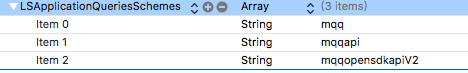

### 冲突：
官方SDK 与 ShareSDK 集成在同一个Project中，不同的target时：
当使用如下引入方式时，会出现冲突问题： 
```objc
#import <WXApi.h>
```
解决办法，将包的位置写完即可,如下：
```objc
#import <WechatOpenSDK/WXApi.h>
```
其他相关API引入，也要保证引入的是全路径。

### URL scheme
LSApplicationQueriesSchemes在ios9之后改变了URLScheme 的用法

QQ包含三个：



微信端无需配置。

### 制定APP打开文件类型
Uniform type identifiers(UTIs)提供了在整个系统里面标识数据的一个统一的方式，比如documents(文档)、pasteboard data(剪贴板数据)和bundles(包)。

### 真机调试免费App ID出现的问题
`The maximum number of apps for free development profiles has been reached.`

免费应用程序调试最大限度

苹果免费App ID只能运行2个应用程序,当调试第三个的时候就会报这个错误,必须把之前的应用程序删除,才能调试新。

[解决方案](http://www.jianshu.com/p/99c441070b22)

### 系统提供的分享方式

1. UIDocumentInteractionController方式

//需要使用全局变量，否则会因对象提早释放报错：`UIDocumentInteractionController has gone away prematurely`

```objc
- (void)setupDocumentControllerWithURL:(NSURL *)url
{
UIDocumentInteractionController * docInteractionController = [UIDocumentInteractionController interactionControllerWithURL:url];
CGRect navRect;
if ([[UIDevice currentDevice] userInterfaceIdiom] == UIUserInterfaceIdiomPhone) {
navRect = self.navigationController.navigationBar.frame;
navRect.size = CGSizeMake(1500.0f, 30.0f);
}else{

navRect = _ibRightView.frame;
navRect.origin = CGPointMake(navRect.origin.x - 40, navRect.origin.y + 20);
//      navRect.origin.x = CGRectGetMinX(navRect) - 40;

}
[docInteractionController presentOpenInMenuFromRect:navRect inView:self.view  animated:YES];
}
```
### quicklook 支持同时浏览多个文件
```objc
#pragma mark - QuickLook
-(IBAction)QuickLook:(id)sender
{
QLPreviewController *preView = [[QLPreviewController alloc] init];
preView.dataSource = self;
[self presentViewController:preView animated:YES completion:nil];
}


/**
这里我返回的PreviewItems的数量为1，就是一次加载一个文件，这里可以是多个文件的数组个数，也就是某个本地路径下的多个文件，大家可以自己实现下。

@param controller 当前浏览器控制器
@return 一次浏览文件的个数，返回Url数组的文件个数
*/
-(NSInteger)numberOfPreviewItemsInPreviewController:(QLPreviewController *)controller
{
return preFileURLs.count;
}

/**
其实NSURL的分类遵循了QLPreviewItem协议，这里可以返回一个Url数组。这就是预览多个文件时的数据源方法，注意：以上两个方法是@required的，必须需要实现的。

@param controller 当前预览控制器
@param index 当前预览的第几个文件
@return 一个文件URL，当在浏览多个文件时，则可返回Url数组
*/
-(id<QLPreviewItem>)previewController:(QLPreviewController *)controller previewItemAtIndex:(NSInteger)index
{
return preFileURLs[index];
}
```

### 微信SDK 官方文件接口描述
不支持描述信息，logo图标的设置：
```objc
#pragma mark - WXFileObject
/*! @brief 多媒体消息中包含的文件数据对象
*
* @see WXMediaMessage
*/
@interface WXFileObject : NSObject

/*! @brief 返回一个WXFileObject对象
*
* @note 返回的WXFileObject对象是自动释放的
*/
+(WXFileObject *) object;

/** 文件后缀名
* @note 长度不超过64字节
*/
@property (nonatomic, retain) NSString  *fileExtension;

/** 文件真实数据内容
* @note 大小不能超过10M
*/
@property (nonatomic, retain) NSData    *fileData;

@end
```

### QQSDK 分享文件API
暂时不支持普通方式的文件分享
```objc
//QQApiFileObject
/** @brief 本地文件对象(暂只支持分享到手机QQ数据线功能)
用于分享文件内容的对象，是一个指定为文件类型的<code>QQApiExtendObject</code>
*/
@interface QQApiFileObject : QQApiExtendObject
{
NSString* _fileName;
}
@property(nonatomic, retain)NSString* fileName;
@end
```
总结：对于QQAPI不支持分享文件，相应只能使用原有的Document系统接口来实现，这样就无法得知时候分享成功进行统计。
对于WXAPI支持分享文件，但不支持自定义文件图标，
## 配置回调代理的两个地方
在iOS9及以上系统，则必须要实现以下方法，在其中配置第三方分享代理。   

第三方分享回调前提条件：  
1. 需要按照第三方分享APP文档，来配置对应的URL scheme：在ios9之后改为LSApplicationQueriesSchemes来配置。  
2. 在第一步基础上，微信分享完成时，才能成功回调系统方法:`application:openURL:options:`，进而配置第三方app回调代理。   

Document的使用：    
1. Document types配置APP能够打开的文件类型    
2. "使用其他应用打开..." ,选中APP图标，会调用 `application:openURL:sourceApplication:annotation:`  

### 第三方分享完成，返回APP时
回调application:openURL:options: ，iOS9之后废弃了application:handleOpenURL:代理方法

```objc
- (BOOL)application:(UIApplication *)app
            openURL:(NSURL *)url
            options:(NSDictionary<UIApplicationOpenURLOptionsKey, id> *)options
{
    // 配置weixin／QQ代理
    BOOL weixin = [WXApi handleOpenURL:url delegate:self];
    BOOL qq = [TencentOAuth HandleOpenURL:url];
    if (weixin)
    {
        //微信回调处理
    }
    if(qq)
    {
        //qq回调处理
    }
    return weixin;
}
```

### "使用其他应用打开..."启动APP
调用：application:openURL:sourceApplication:annotation:

在这里也可以配置微信/QQ分享代理
```objc
// 其他方式打开，选择后APP后调用
-(BOOL)application:(UIApplication *)application
           openURL:(NSURL *)url
 sourceApplication:(NSString *)sourceApplication
        annotation:(id)annotation
{
    //拷贝到APP中本地的文档路径 url.path :路径前缀有file:/// 或 file://localhost
    NSLog(@"文档路径：%@",url.path);
    BOOL weixin = [WXApi handleOpenURL:url delegate:self];
    BOOL qq = [TencentOAuth HandleOpenURL:url];
    return YES;
}
```

